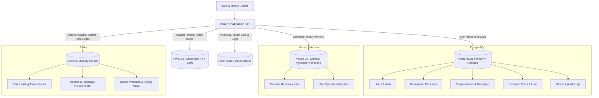

# Production Database & Storage Architecture

## AI Companion & Dating Platform (Enterprise Scale)

This document provides a comprehensive, production-grade database schema and multi-tier storage design for the AI Dating Companion Chatbot platform. It details **what data is stored, where it is stored, how it is indexed, and how it scales** to millions of concurrent users with sub-100ms response times.

---


## 1. High-Level Multi-Tier Storage Topology

In an enterprise-grade AI system, a single database is never sufficient. We use a **Polyglot Persistence Architecture** where each data type lives in its optimal storage engine:



---

## 2. Storage Tier Matrix (Where Each Piece of Data Lives)

| Data Category                        | Target Engine                      | Purpose & SLA                                                 | Retention / Lifespan              |
| :----------------------------------- | :--------------------------------- | :------------------------------------------------------------ | :-------------------------------- |
| **User Accounts & Auth**       | PostgreSQL (Primary)               | ACID compliance, unique constraints, auth lookups (<5ms)      | Permanent (until GDPR deletion)   |
| **Companion Personas**         | PostgreSQL + JSONB                 | Persona configurations, style rules, system prompt templates  | Permanent, versioned              |
| **Chat Threads & Messages**    | PostgreSQL (Partitioned)           | Complete audit trail, chat history pagination                 | Permanent (or user-deleted)       |
| **Semantic Lore & Knowledge**  | Vector DB (e.g. Qdrant / Pinecone) | High-speed Cosine similarity search for RAG retrieval (<15ms) | Synced with persona lifecycle     |
| **User Personal Memories**     | Vector DB + PostgreSQL             | Long-term memory facts extracted from user conversations      | Permanent per user-companion pair |
| **Recent Message Buffer**      | Redis Cluster                      | Instant prompt context assembly (<2ms lookup)                 | Sliding window (Last 20 messages) |
| **Rate Limits & Typing State** | Redis Cluster                      | WebSocket presence, anti-abuse, token limits                  | Ephemeral (Seconds to 24h TTL)    |
| **Avatars & Image Assets**     | Cloudflare R2 / AWS S3 + CDN       | Media delivery, edge image resizing (<50ms globally)          | Permanent                         |
| **LLM Token & Cost Telemetry** | TimescaleDB / ClickHouse           | Real-time billing, latency tracking, model cost analysis      | 90 days to 1 year                 |

---

## 3. Relational Database Schema (PostgreSQL Production DDL)

Below is the standard, production-ready PostgreSQL DDL with proper types (`UUID`, `TIMESTAMPTZ`), constraints, foreign keys with cascading, and high-performance compound B-Tree indexes.

### 3.1. Users Table (`users`)

Stores core identity, credentials, subscription tiers, and locale.

```sql
CREATE EXTENSION IF NOT EXISTS "uuid-ossp";

CREATE TYPE subscription_tier_enum AS ENUM ('free', 'plus', 'premium', 'vip');
CREATE TYPE user_status_enum AS ENUM ('active', 'suspended', 'deactivated');

CREATE TABLE users (
    id UUID PRIMARY KEY DEFAULT uuid_generate_v4(),
    email VARCHAR(255) UNIQUE NOT NULL,
    phone_number VARCHAR(30) UNIQUE,
    password_hash VARCHAR(255),               -- Nullable if OAuth (Google/Apple) is used
    auth_provider VARCHAR(50) DEFAULT 'local', -- 'local', 'google', 'apple'
    provider_user_id VARCHAR(255),
    display_name VARCHAR(100) NOT NULL,
    age INT CHECK (age >= 18),                 -- Strict dating app age requirement
    gender VARCHAR(30),
    preferred_language VARCHAR(10) DEFAULT 'en', -- 'en', 'hi', 'hinglish'
    subscription_tier subscription_tier_enum DEFAULT 'free',
    daily_message_limit INT DEFAULT 50,
    messages_sent_today INT DEFAULT 0,
    status user_status_enum DEFAULT 'active',
    last_active_at TIMESTAMPTZ DEFAULT CURRENT_TIMESTAMP,
    created_at TIMESTAMPTZ DEFAULT CURRENT_TIMESTAMP,
    updated_at TIMESTAMPTZ DEFAULT CURRENT_TIMESTAMP,
    deleted_at TIMESTAMPTZ                     -- Soft delete for data recovery & compliance
);

-- Indexes for lightning fast lookups
CREATE INDEX idx_users_email ON users(email) WHERE deleted_at IS NULL;
CREATE INDEX idx_users_auth_provider ON users(auth_provider, provider_user_id);
CREATE INDEX idx_users_last_active ON users(last_active_at);
```

---

### 3.2. User Dating Preferences (`user_dating_profiles`)

Stores what the user is looking for to tailor companion interactions.

```sql
CREATE TABLE user_dating_profiles (
    user_id UUID PRIMARY KEY REFERENCES users(id) ON DELETE CASCADE,
    city VARCHAR(100),
    country VARCHAR(100) NOT NULL,
    bio TEXT,
    relationship_intent VARCHAR(100),         -- e.g. "Long-term", "Casual chats", "Deep talks"
    interests JSONB DEFAULT '[]'::jsonb,      -- Array of strings: ["Music", "Travel", "Tech"]
    love_language VARCHAR(50),                -- "Words of affirmation", "Quality time"
    communication_style VARCHAR(50),          -- "Deep & slow", "Fast & witty"
    updated_at TIMESTAMPTZ DEFAULT CURRENT_TIMESTAMP
);

CREATE INDEX idx_user_dating_country ON user_dating_profiles(country, city);
CREATE INDEX idx_user_dating_interests ON user_dating_profiles USING GIN (interests);
```

---

### 3.3. Companion Personas Table (`companion_personas`)

Stores public profile info, dynamic style rules, private system templates, and safety parameters.

```sql
CREATE TYPE persona_visibility_enum AS ENUM ('official', 'community', 'private');

CREATE TABLE companion_personas (
    id VARCHAR(80) PRIMARY KEY,               -- e.g. 'profile_luna_1a2b'
    created_by_user_id UUID REFERENCES users(id) ON DELETE SET NULL, -- NULL for official AI
    name VARCHAR(100) NOT NULL,
    age INT NOT NULL,
    gender VARCHAR(30) NOT NULL,
    country VARCHAR(100) NOT NULL,
    city VARCHAR(100),
    short_bio VARCHAR(250) NOT NULL,
    avatar_url TEXT NOT NULL,
    tone VARCHAR(100) NOT NULL,
    relationship_intent VARCHAR(150),
    personality_traits JSONB NOT NULL DEFAULT '[]'::jsonb, -- ["warm", "witty", "curious"]
    conversation_style_rules JSONB NOT NULL DEFAULT '[]'::jsonb,
    initial_openers JSONB NOT NULL DEFAULT '[]'::jsonb,
    full_backstory TEXT NOT NULL,
    system_prompt_template TEXT NOT NULL,      -- Secret prompt engine template
    visibility persona_visibility_enum DEFAULT 'official',
    is_active BOOLEAN DEFAULT TRUE,
    total_chats_count BIGINT DEFAULT 0,
    rating_score NUMERIC(3, 2) DEFAULT 5.00,
    created_at TIMESTAMPTZ DEFAULT CURRENT_TIMESTAMP,
    updated_at TIMESTAMPTZ DEFAULT CURRENT_TIMESTAMP,
    deleted_at TIMESTAMPTZ
);

CREATE INDEX idx_personas_visibility ON companion_personas(visibility, is_active) WHERE deleted_at IS NULL;
CREATE INDEX idx_personas_country ON companion_personas(country);
CREATE INDEX idx_personas_traits ON companion_personas USING GIN (personality_traits);
```

---

### 3.4. Conversations Table (`conversations`)

Manages thread sessions between a user and a companion persona.

```sql
CREATE TABLE conversations (
    id UUID PRIMARY KEY DEFAULT uuid_generate_v4(),
    user_id UUID NOT NULL REFERENCES users(id) ON DELETE CASCADE,
    profile_id VARCHAR(80) NOT NULL REFERENCES companion_personas(id) ON DELETE CASCADE,
    title VARCHAR(150) DEFAULT 'Chat',
    summary TEXT,                             -- Rolling conversation summary generated by background LLM
    last_message_at TIMESTAMPTZ DEFAULT CURRENT_TIMESTAMP,
    total_messages INT DEFAULT 0,
    is_pinned BOOLEAN DEFAULT FALSE,
    is_archived BOOLEAN DEFAULT FALSE,
    created_at TIMESTAMPTZ DEFAULT CURRENT_TIMESTAMP,
    CONSTRAINT uq_user_profile_convo UNIQUE (user_id, profile_id)
);

CREATE INDEX idx_convos_user_last_msg ON conversations(user_id, last_message_at DESC);
CREATE INDEX idx_convos_profile ON conversations(profile_id);
```

---

### 3.5. Messages Table (`messages` - Range Partitioned)

In high-volume companion apps, messages grow into hundreds of millions of rows. We **partition the table by month** to maintain consistent query speed and easy archiving.

```sql
CREATE TYPE message_role_enum AS ENUM ('user', 'assistant', 'system');

CREATE TABLE messages (
    id BIGSERIAL,
    conversation_id UUID NOT NULL REFERENCES conversations(id) ON DELETE CASCADE,
    user_id UUID NOT NULL,
    profile_id VARCHAR(80) NOT NULL,
    role message_role_enum NOT NULL,
    content TEXT NOT NULL,
    language_detected VARCHAR(20) DEFAULT 'english', -- 'english', 'hinglish', 'hindi'
    tokens_prompt INT DEFAULT 0,
    tokens_completion INT DEFAULT 0,
    latency_ms INT DEFAULT 0,
    llm_provider VARCHAR(50),                         -- 'groq', 'claude', 'openai'
    llm_model VARCHAR(80),                            -- 'qwen-2.5-32b', 'llama-3.3-70b'
    sentiment_score NUMERIC(3, 2),                   -- -1.00 to +1.00
    is_flagged BOOLEAN DEFAULT FALSE,                 -- Flagged by moderation
    created_at TIMESTAMPTZ NOT NULL DEFAULT CURRENT_TIMESTAMP,
    PRIMARY KEY (id, created_at)
) PARTITION BY RANGE (created_at);

-- Monthly partition examples
CREATE TABLE messages_2026_09 PARTITION OF messages
    FOR VALUES FROM ('2026-09-01 00:00:00+00') TO ('2026-10-01 00:00:00+00');

CREATE TABLE messages_2026_10 PARTITION OF messages
    FOR VALUES FROM ('2026-10-01 00:00:00+00') TO ('2026-11-01 00:00:00+00');

-- High-performance compound indexes for pagination
CREATE INDEX idx_messages_convo_created ON messages(conversation_id, created_at DESC);
CREATE INDEX idx_messages_user_profile ON messages(user_id, profile_id, created_at DESC);
```

---

### 3.6. User Episodic Memories & RAG Facts (`user_memories`)

Tracks personalized facts extracted from chat (e.g., "User's dog is named Milo", "User has a sister in Pune", "User hates spicy food").

```sql
CREATE TYPE memory_category_enum AS ENUM (
    'personal_fact', 'preference', 'emotion_pattern', 'boundary', 'goal', 'relationship'
);

CREATE TABLE user_memories (
    id UUID PRIMARY KEY DEFAULT uuid_generate_v4(),
    user_id UUID NOT NULL REFERENCES users(id) ON DELETE CASCADE,
    profile_id VARCHAR(80) NOT NULL REFERENCES companion_personas(id) ON DELETE CASCADE,
    category memory_category_enum NOT NULL DEFAULT 'personal_fact',
    fact_text TEXT NOT NULL,
    confidence_score NUMERIC(3, 2) DEFAULT 0.90,     -- Extractor confidence
    importance_score INT DEFAULT 3 CHECK (importance_score BETWEEN 1 AND 5),
    vector_id VARCHAR(100),                           -- ID in Vector Database
    source_message_id BIGINT,
    last_recalled_at TIMESTAMPTZ,
    recall_count INT DEFAULT 0,
    created_at TIMESTAMPTZ DEFAULT CURRENT_TIMESTAMP,
    updated_at TIMESTAMPTZ DEFAULT CURRENT_TIMESTAMP
);

CREATE INDEX idx_memories_user_profile ON user_memories(user_id, profile_id, importance_score DESC);
CREATE INDEX idx_memories_category ON user_memories(category);
```

---

### 3.7. Content Moderation & Safety Audit Logs (`safety_audit_logs`)

Guarantees safety compliance (Politics, Religion, NSFW, Harassment).

```sql
CREATE TYPE moderation_flag_enum AS ENUM (
    'politics', 'religion', 'nsfw_erotic', 'hate_speech', 'harassment', 'self_harm'
);

CREATE TABLE safety_audit_logs (
    id BIGSERIAL PRIMARY KEY,
    conversation_id UUID REFERENCES conversations(id) ON DELETE SET NULL,
    user_id UUID REFERENCES users(id) ON DELETE CASCADE,
    profile_id VARCHAR(80),
    flag_type moderation_flag_enum NOT NULL,
    detected_phrase TEXT,
    user_message_snippet TEXT,
    system_action_taken VARCHAR(100) NOT NULL, -- 'casually_deflected', 'blocked', 'warning_issued'
    ip_address INET,
    created_at TIMESTAMPTZ DEFAULT CURRENT_TIMESTAMP
);

CREATE INDEX idx_safety_user_flag ON safety_audit_logs(user_id, flag_type);
CREATE INDEX idx_safety_created_at ON safety_audit_logs(created_at DESC);
```

---

## 4. Vector Database Architecture (Qdrant / PgVector / Pinecone)

We separate vectors into two distinct collections to avoid cross-contamination between static lore and personal user memories:

```
Vector Database Collections:
│
├── 1. persona_static_knowledge
│   ├── Partition by: profile_id
│   ├── Payload: { profile_id, chunk_type: "backstory" | "trait" | "style_rule", text }
│   └── Vector Dim: 384 or 1536 (Normalized Cosine)
│
└── 2. user_episodic_memories
    ├── Partition by: user_id & profile_id
    ├── Payload: { memory_id, user_id, profile_id, fact_text, importance, category, timestamp }
    └── Vector Dim: 384 or 1536 (Normalized Cosine)
```

### Vector Search Query Example (RAG Retrieval):

When a user sends *"Do you remember what my pet was?"*:

1. Filter: `user_id == 'uuid-123' AND profile_id == 'profile_luna'`
2. Top-K: `k=3`
3. Similarity Threshold: `score >= 0.72`
4. Result: `{"fact_text": "User has a golden retriever named Max", "importance": 5}` injected directly into prompt context.

---

## 5. In-Memory Redis Architecture & Key Schema

Redis provides sub-millisecond data access for chat orchestration, rate limits, and live connection states:

| Key Pattern                  | Data Structure       | TTL         | Purpose                                                                |
| :--------------------------- | :------------------- | :---------- | :--------------------------------------------------------------------- |
| `buffer:{convo_id}`        | List (LPUSH / LTRIM) | 7 days      | Last 20 messages for instant prompt building without touching Postgres |
| `ratelimit:{user_id}:min`  | Integer (INCR)       | 60 seconds  | Enforces 15 messages/minute throttle                                   |
| `typing:{convo_id}`        | String               | 5 seconds   | Real-time companion typing indicator flag                              |
| `presence:{user_id}`       | Hash (HSET)          | 120 seconds | Heartbeat / active online presence                                     |
| `llm_circuit_breaker:groq` | Hash                 | 5 minutes   | Tracks failure rate for auto-fallback to Claude                        |
| `lock:msg_dedup:{hash}`    | String (SETNX)       | 10 seconds  | Prevents double message submission on network jitter                   |

---

## 6. Object Storage (Cloudflare R2 / AWS S3) & CDN Hierarchy

All media is served through a CDN (Cloudflare / CloudFront) with immutable caching headers:

```
s3://dating-companion-media/
│
├── avatars/
│   ├── official/
│   │   ├── luna_portrait_1024.webp
│   │   ├── ethan_portrait_1024.webp
│   │   └── diya_portrait_1024.webp
│   └── custom/
│       └── {user_id}/
│           └── {profile_id}_avatar.webp
│
├── thumbnails/
│   └── {profile_id}_thumb_128x128.webp
│
└── exports/
    └── {user_id}_gdpr_chat_history.zip
```

* **Best Practice:** Images uploaded via the modal are automatically downsized, converted to `.webp`, and served via CDN caching (`Cache-Control: public, max-age=31536000, immutable`).

---

## 7. Scalability, Security & Production Best Practices

1. **Connection Pooling (PgBouncer):**
   * Production FastAPI pods use `asyncpg` with **PgBouncer** in transaction mode (`pool_size=20`, `max_overflow=10`).
2. **Read-Replica Routing:**
   * `GET /profiles` and history pagination queries hit **Read Replicas**.
   * New messages (`POST /chat`) and profile mutations hit the **Primary Writer**.
3. **Data Protection & GDPR Compliance:**
   * Complete cascaded deletion when a user triggers **"Delete Profile"** or deletes their account:
     * Postgres: `ON DELETE CASCADE` wipes threads and messages.
     * Vector DB: Deletes all vectors matching `metadata.profile_id`.
     * Redis: `DEL buffer:{convo_id}` cleans cache.
     * S3: Deletes custom avatar files.
4. **Data Encryption:**
   * At Rest: AWS KMS / Postgres Transparent Data Encryption (`AES-256`).
   * In Transit: Mandatory `TLS 1.3` for all database, Redis, and client connections.
